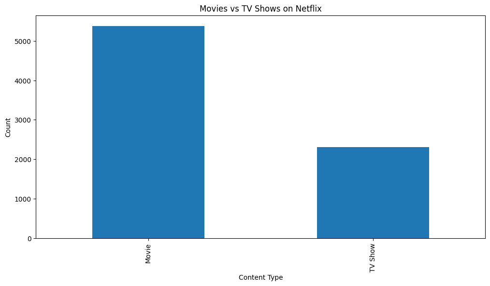
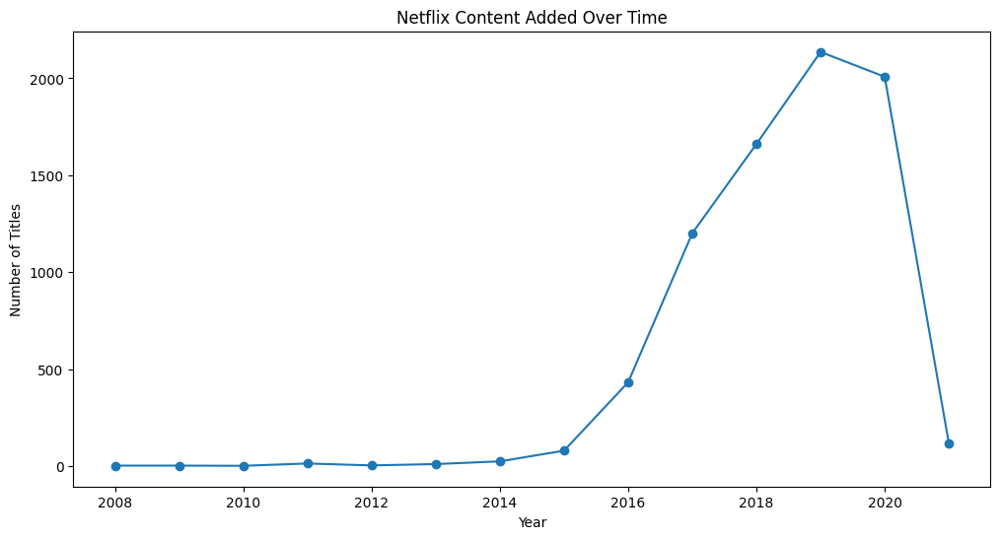
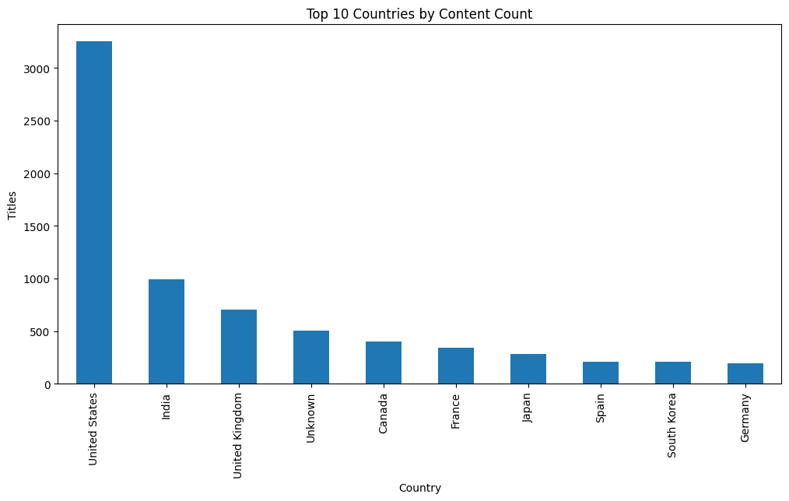
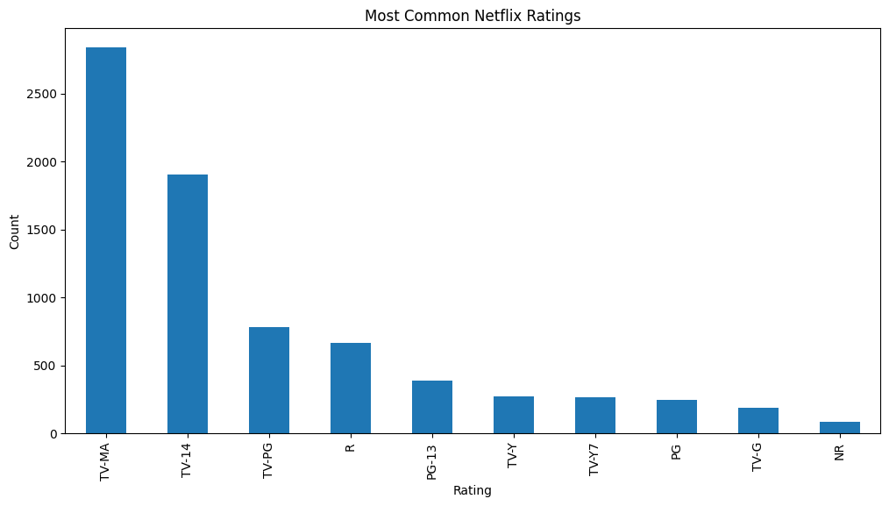
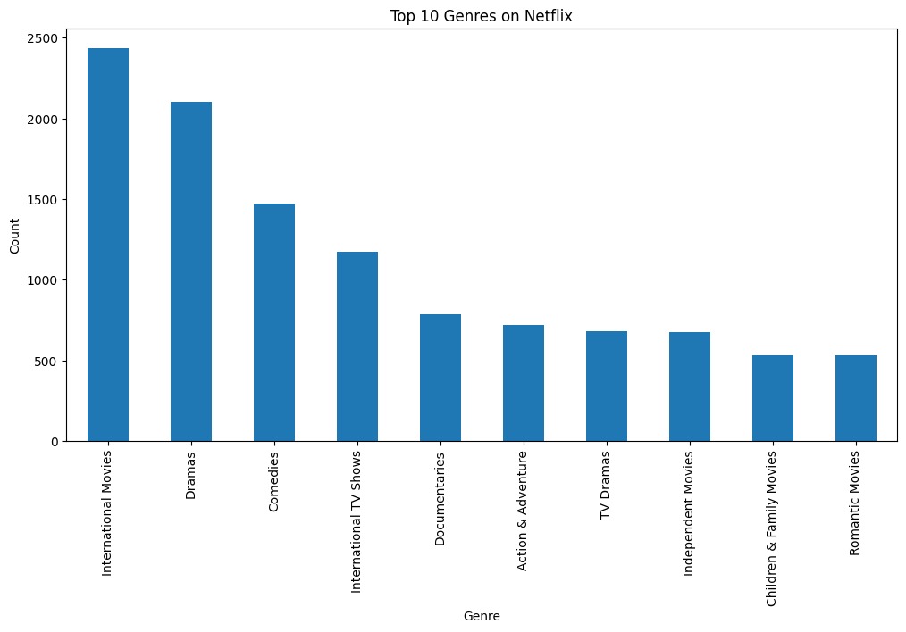

# Netflix Content Analytics

## Project Overview

This project analyzes Netflix's content catalog to uncover trends in content distribution, growth, ratings, genres, and geographic contributions.

The objective is to understand how Netflix has expanded its content library over time and identify key patterns that can support content strategy decisions.

---
## Project Highlights

* Performed end-to-end data cleaning and preprocessing.
* Conducted exploratory data analysis (EDA) on 8,000+ Netflix titles.
* Created multiple visualizations to uncover content trends and patterns.
* Generated business insights and recommendations based on data findings.
* Organized the project using industry-standard Data Science project structure.

---


## Business Understanding

Netflix is one of the world's leading streaming platforms, offering thousands of movies and TV shows globally.

Understanding content trends can help identify:

* Growth patterns
* Popular content categories
* Geographic content distribution
* Audience targeting strategies
* Future content investment opportunities

---

## Dataset

**Dataset:** Netflix Titles Dataset

The dataset contains information about Netflix titles including:

* Type (Movie / TV Show)
* Title
* Director
* Cast
* Country
* Date Added
* Release Year
* Rating
* Duration
* Genre

---

## Tools & Technologies

* Python
* Pandas
* NumPy
* Matplotlib
* Jupyter Notebook

---

## Project Structure

```text
Netflix-Content-Analytics/
│
├── data/
│   └── netflix_titles.csv
│
├── notebooks/
│   └── netflix_analysis.ipynb
│
├── images/
│
├── reports/
│   └── project_report.md
│
├── README.md
├── requirements.txt
└── .gitignore
```

## Data Cleaning

The following preprocessing steps were performed:

* Removed duplicate records
* Handled missing values
* Converted date_added to datetime format
* Created year_added feature
* Removed 98 records with missing date information
* Standardized text fields

---

## Exploratory Data Analysis

The following analyses were performed:

* Movies vs TV Shows Distribution
* Content Distribution Percentage
* Content Growth Over Time
* Top Content Producing Countries
* Content Ratings Analysis
* Genre Analysis
* Director Analysis
* Release Year Trends

---

## Key Insights

1. Movies dominate Netflix's content catalog.

2. Netflix experienced significant content growth after 2015.

3. The United States contributes the largest share of content.

4. TV-MA and TV-14 are the most common content ratings.

5. Drama and International Movies are among the most represented genres.

---
## Sample Visualizations

### Movies vs TV Shows Distribution



### Netflix Content Growth Over Time



### Top Content Producing Countries



### Content Ratings Distribution



### Top Genres on Netflix




---


## Recommendations

* Continue expanding international content production.
* Invest in high-performing genres.
* Strengthen regional content offerings.
* Maintain content diversity across audience groups.

---

## Future Improvements

* Interactive dashboard using Power BI or Tableau
* Advanced genre trend analysis
* Recommendation system
* Predictive content analytics

---
## Skills Demonstrated

* Data Cleaning
* Exploratory Data Analysis (EDA)
* Data Visualization
* Feature Engineering
* Business Insight Generation
* Python Programming
* Pandas
* NumPy
* Matplotlib
* Jupyter Notebook

---

## Author

Anshika Vats
